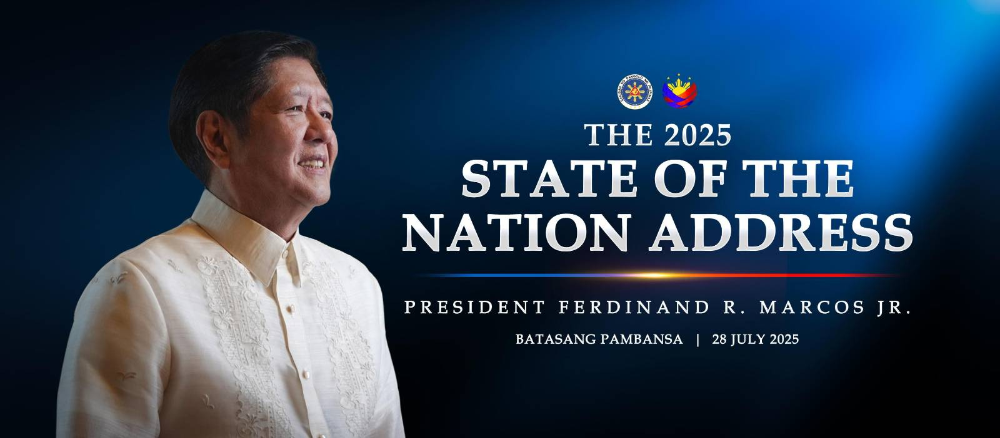

# Take on SONA July 2025 of Pres. Ferdinand R. Marcos Jr.

## by Rea Xyrille Tumbaga, B2029 Lithium

### Key Points I Found Interesting: #### 
- The nationwide rollout of ₱20/kilo rice through KADIWA centers, claiming it won’t harm farmers’ profits (even if the prices are at least double this goal, ₱42.7).
- The internet-for-all-schools goal by end of 2025, along with the jump from 4,000 to 19,000 Free Wi-Fi sites.
- Full coverage of hospital expenses in DOH facilities under zero-balance billing.
- Payment of public school teachers for overload and overtime.

### Weird or Surprising Points: ####
- The revival of the “Love Bus” as a free transportation option was unexpected, especially in modern urban contexts.
- The President’s strong emotional appeal, “mahiya naman kayo” when calling out corrupt officials.
- Highlighting Zumba, fun runs, and “Car-Free Sundays” as national fitness solutions.

### Watch the SONA 2025: 

### My Reflection on the SONA: ####
President Marcos’ 2025 SONA was packed with promises addressing long-standing issues like food prices, energy access, and education. He once again emphasized his pledge of ₱20/kilo rice, insisting that we will finally see it happen, just like many of the goals he stated as early as his first SONA. But here’s the thing: President Bongbong Marcos has already made most of these promises before. What happened since then? Why do so many outspoken Filipinos still feel disconnected from the supposed progress of this administration?

Let’s be honest, given the country’s current state and rising debt, I don't think most of what PBBM has planned for this year would happen. Even with a reported 5.4% GDP growth in 2025, the use of confidential funds, corrupt officials, and ongoing foreign debt raise serious concerns about transparency and priorities. Projects like nationwide free internet for public schools or zero-balance billing in all DOH hospitals are ambitious, maybe even unrealistic, given our limited resources. If we were a country like Japan or Canada, such policies might be feasible, but the sad truth is we're not. As a developing nation, we need more than just idealistic vision. We need grounded, strategic action. That is why I would like to truly see the actions he'd take this year.

### For the Philippines: #### 
**"Kahit na mukha tayong nahuhulog, patuloy lang na umasa sa pagsapit ng pagkakataong lumipad muli."**